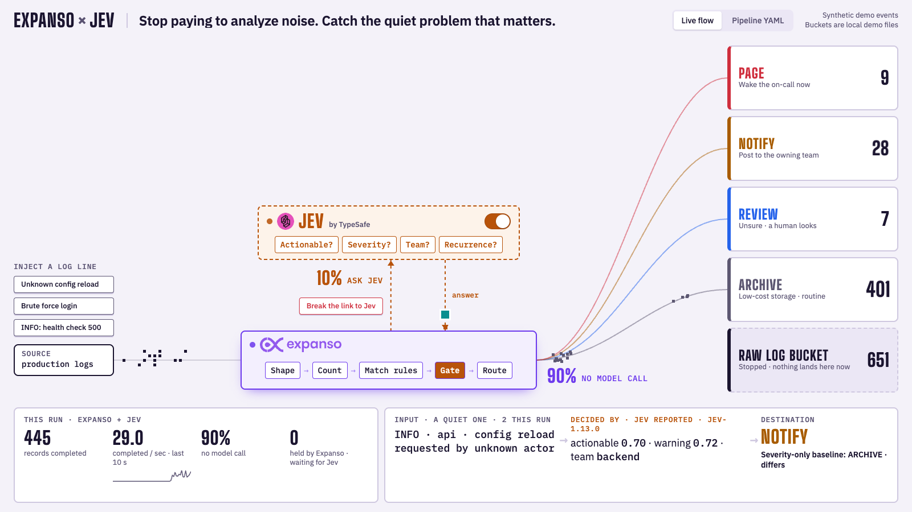

# Expanso × Jev

Put a model in the hot path of your logs without paying for it on every line.



Most log lines are routine, and a rule can say so instantly. A few are not, and
no rule you have written yet knows which. This repository shows one way to
handle both in a single pipeline:

- **[Expanso Edge](https://expanso.io)** runs next to the source. It shapes each
  record, fingerprints it, counts how often it has been seen, and sends known
  routine lines straight to the archive with no model call.
- **[Jev](https://typesafe.ai)**, TypeSafe's structured classifier, is asked only
  about what is left. It answers four questions per record (actionable?
  severity? owning team? recurrence concern?) and the pipeline routes on the
  answers: page, notify, review, or archive.
- When Jev cannot be reached, the pipeline **holds** those records, keeps
  routine traffic moving, and releases the backlog when Jev answers again.
  Nothing is guessed and nothing is dropped.

In our runs about nine lines in ten never touched the model. Your number will
differ; the board measures it live.

## What you need

- macOS or Linux, [`just`](https://github.com/casey/just), `python3`, `curl`.
  [`uv`](https://docs.astral.sh/uv/) if you want to run the tests.
- Expanso Edge and the Expanso CLI, v2 or later, on your `PATH`
  (`expanso-edge`, `expanso-cli`). See the [Expanso docs](https://docs.expanso.io).
- An [Expanso Cloud](https://cloud.expanso.io) network. Pipelines here are always
  deployed through Expanso Cloud; the agent on your machine runs them.
- A TypeSafe API key for Jev. No key yet? Use the bundled mock (below). The
  board labels mock answers in red, because they are keyword heuristics and
  not inference.

## Pod-label browser demo

Three ordinary Kubernetes pods stream logs to Expanso Cloud. Choose a pod
and one of two live workflows:

- **Label:** Jev judges proposed labels and reversals. The board
  shows actual Kubernetes Service membership and observed label sources.
- **Investigate:** Jev assesses restart evidence and returns Wait or
  Investigate. Details stay collapsed; no additional model is invoked.

Source incidents are explicitly simulated. Cloud execution, Jev responses,
Kubernetes patches, and Service membership are real.

```bash
just up
```

Open **http://127.0.0.1:8901** after READY. See the
[pod demo prerequisites and runbook](demos/11-pod-labels/README.md).
Inside `demos/11-pod-labels`, `just up` runs that demo directly.
At the root, `just up`, `just down`, `just open`, `just status`, and
`just test` target the pod demo. Add `triage` to lifecycle commands for
the original log-triage demo.

## Log-triage quickstart

```bash
just init        # creates .env from .env.example
$EDITOR .env     # the three EXPANSO_* values from your Cloud network
just jev-key     # prompts for your TypeSafe key (hidden input)
just doctor      # checks tools, credentials and reachability
just up triage   # takes about a minute; opens on "no pipeline"
just open triage # http://127.0.0.1:8890
```

Then walk through it:

```bash
just act2        # deploy the Expanso-only pipeline
just act3        # deploy the version that adds Jev
just down triage # stop everything, including the job in Cloud
```

You can also deploy the two YAML files from the Expanso Cloud console, or flip
the Jev switch on the board. The board follows whatever is actually running.

**Without a TypeSafe key:** run `uv run shared/jev-mock-server.py` in another
terminal, set `JEV_API_URL=http://127.0.0.1:8099/v1/systemone` in `.env`, and
skip `just jev-key`.

`just` on its own lists every recipe. `just status` shows what is alive,
`just logs <name>` tails a component, and `just reset-agent` clears the agent's
local execution store if it ever restarts a pipeline Cloud no longer knows about.

## The three acts

| | What is deployed | What happens |
|---|---|---|
| 1 | nothing | Every log line is shipped, exactly as written, to a raw bucket. |
| 2 | `pipeline-logging.yaml` | Expanso shapes, fingerprints and counts each record. Everything is archived, now structured. |
| 3 | `pipeline-recurrence.yaml` | Known routine lines skip the model. Everything else goes to Jev, with its history, and is routed on the answer. |

On the board you can inject a log line and follow it as one large square
through the pipeline, up to Jev and back, and into the bucket it really landed
in. **Break the link to Jev** simulates an outage so you can watch the hold and
the release. Click any bucket for the latest record's full JSON, grouped by who
added each field.

Details, environment variables and troubleshooting:
[`demos/01-log-triage/README.md`](demos/01-log-triage/README.md).

## What is in here

| Path | What |
|---|---|
| `demos/01-log-triage/` | The full live demo: generator, two pipelines, dashboard, tests. |
| `demos/02-…` to `demos/10-…` | Nine more Expanso + Jev pipelines, each a `pipeline.yaml`, sample `input.jsonl` and a README: ticket routing, sensitivity masking, sensor triage, agent guardrails, smart sampling, SOC pre-filtering, data quality, moderation, feedback mining. Pipelines only; no dashboard yet. |
| [`demos/11-pod-labels/`](demos/11-pod-labels/README.md) | Keeps Kubernetes pod labels true: Expanso reads pod logs, asks Jev one question when the evidence might change a label, and patches or un-patches it. Runs on a local k3d cluster with one command; the adapter and pipeline work on your own cluster too. |
| `shared/jev-mock-server.py` | A zero-credential stand-in for Jev's API. |
| `display/fancy/jev-flow.html` | A standalone animated walkthrough of the idea. `just flow`. |
| `tools/expanso-agent-help.py`, `AGENTS.md` | How the Expanso CLIs take credentials from the environment, for people and coding agents. `just agent-help`. |

## What this does and does not show

- The events are synthetic, and the four destinations are local JSONL files,
  not a pager or a chat tool. The board says so on screen.
- Jev's answers are real when you use a real key, but they are observed
  judgments on sample events. This repository makes no accuracy claim.
- The routine-line allowlist matches exact messages on purpose. A fingerprint
  erases numbers, and `GET /health 500` must not pass as `GET /health 200`.
- The outage is simulated by a local gate that every Jev call passes through.
  The failed calls, the hold and the release are the pipeline's real behavior.
- Credentials live in `.env` and in a project-local agent directory, both
  gitignored. The TypeSafe key never enters a pipeline file, Expanso Cloud, or
  a command line.

## License

Apache-2.0, see [`LICENSE`](LICENSE). Not covered by it: the vendored fonts under
`demos/01-log-triage/fonts/` (IBM Plex and Big Shoulders Display, SIL Open Font
License 1.1), and the Expanso and TypeSafe marks under
`demos/01-log-triage/assets/`, which are trademarks of their owners.
