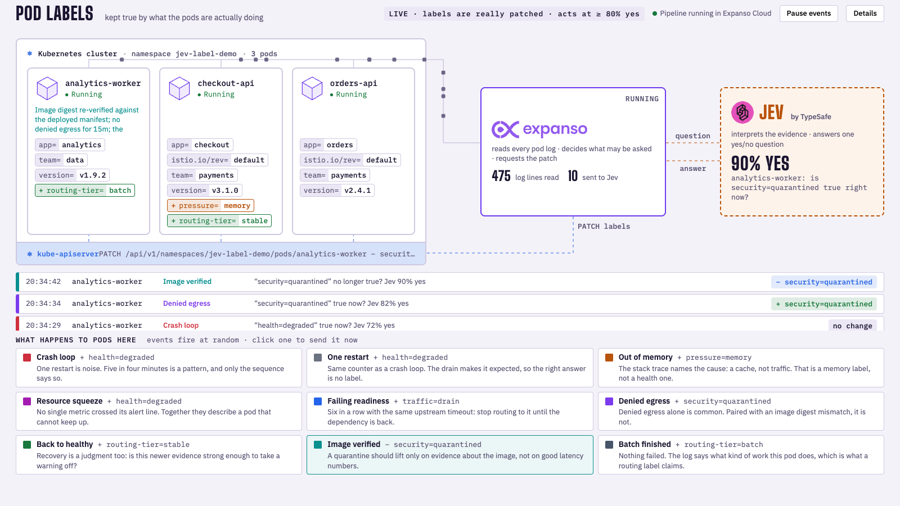

# Pod labels that stay true



Labels drive routing, scheduling and policy, and they go stale the moment a
pod's behavior changes. This example keeps them current: an Expanso pipeline
reads every pod's logs, and when a line might change what is true about the
pod, it asks Jev one yes/no question and patches the label only on a
confident yes. When later evidence says the label no longer holds, it takes
it back off.

- **Expanso** reads the logs, decides which single label change the evidence
  could justify, and requests the patch. It runs as a job in Expanso Cloud on
  an Edge node next to the cluster.
- **Jev** interprets the evidence. It answers a question; it never touches
  Kubernetes.
- **Kubernetes** applies the change, guarded by pod UID and resource version.

## Run it

You need `uv`, `just`, Docker, `k3d`, `kubectl`, `expanso-cli` and
`expanso-edge`, plus your Expanso Cloud credentials and `TYPESAFE_API_KEY` in
the repository-root `.env` (see `../../.env.example`).

```bash
just up      # local k3d cluster, adapter, Edge agent, Cloud job
just down    # from another terminal; Ctrl-C in the first also works
just test
```

When it prints **READY**, open http://127.0.0.1:8901. Everything it creates
lives in a dedicated `jev-label-demo` cluster and the ignored
`.expanso/pod-labels/` directory.

## What you see

Three pods, each carrying its ordinary labels (`app`, `team`, `version`,
`istio.io/rev`). Routine log lines stream to Expanso constantly and never
reach Jev. Every few seconds one pod writes something that needs
interpreting, and the label stack changes or, just as often, correctly does
not:

| Event | Evidence in the log | Label in question |
|---|---|---|
| Crash loop | 5 restarts in 4 minutes | `health=degraded` |
| One restart | 1 restart after a planned node drain | `health=degraded` (expect no) |
| Out of memory | OOMKilled, stack trace names a cache | `pressure=memory` |
| Resource squeeze | CPU, memory and latency together | `routing-tier=stable` off, then `health=degraded` |
| Failing readiness | 6 probe failures, same upstream timeout | `routing-tier=stable` off, then `traffic=drain` |
| Denied egress | denied connections plus an image digest mismatch | `security=quarantined` |
| Back to healthy | 10 minutes of clean metrics | warnings off, then `routing-tier=stable` |
| Image verified | digest re-verified | `security=quarantined` off |
| Batch finished | batch done, no HTTP listeners | `routing-tier=batch` |

`routing-tier=stable` is not decoration: the `stable-checkout` Service selects
`app=checkout` plus that label, so removing it from `checkout-api` takes the
pod out of the Service's endpoints.

The decision strip shows the question, Jev's answer and what happened. The
header shows the threshold in force.

## What is real and what is simulated

Real: the pods, their stdout, the Cloud job, every Jev call, every Kubernetes
patch. Simulated: the events themselves. The demo pods write the log lines a
troubled workload would write; their actual containers stay healthy, so their
real status is not sent to Jev as evidence.

Jev's answers are judgments, not guarantees. In one session the same healthy
evidence scored between 25% and 89% depending on what the pod had logged
before it. That is why a threshold exists and why **no change** is a first-class
outcome. The adapter defaults to 90%; the local simulator uses 80%.

## Use it on your own cluster

`adapter.py`, `pipeline.yaml`, `edge.yaml` and `deploy.py` are the example.
Everything under `simulation/` exists only to produce events on a laptop.

Outside the simulator, the adapter proposes labels it observes on other pods
in the namespaces you allow (`POD_LABEL_NAMESPACES`), asks Jev whether each
fits the target pod, and records every change it makes in a pod annotation so
it can undo only its own work. It starts in dry run: set
`POD_LABEL_APPLY=true` to let it patch. It needs `get`/`list`/`patch` on pods
and `get` on `pods/log`.

Step-by-step setup for native k3s or an existing cluster, the RBAC, and how
to stop and verify: [MANUAL_SETUP.md](MANUAL_SETUP.md).

## Files

| Path | What |
|---|---|
| `pipeline.yaml` | The Expanso pipeline: wait for an event, collect, ask, apply |
| `adapter.py` | Local HTTP service the pipeline calls: Kubernetes access, the Jev call, guarded patches, the board |
| `edge.yaml`, `deploy.py` | Edge agent config and the Cloud deploy |
| `web/` | The board |
| `simulation/` | `local.py` launcher, `workload.py` event catalog, `fixtures.yaml` pods |
| `test_adapter.py`, `simulation/test_local.py` | Tests; no network, no cluster |
