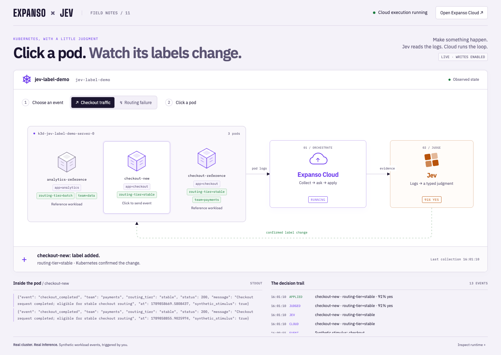

# A pod-label agent with Expanso Cloud and Jev



**A mostly visual browser experience:** choose checkout traffic or a routing
failure, then click `checkout-new`. Its real container writes a synthetic
workload event to stdout. The Cloud-managed pipeline collects those logs,
asks Jev whether a label fits, and updates Kubernetes when the judgment
meets the threshold. The cluster view, log panel and decision trail show
observed evidence; labels only change after Kubernetes accepts the patch.

Implements [Nathan LeClaire's example](https://x.com/dotpem/status/2101432286214525156):
discover labels on every pod in a cluster, compare them with each target pod,
ask Jev whether to add missing labels, and reconsider additions when signals
change. Jev selects observed key/value pairs; it cannot invent labels.

Expanso Cloud schedules the pipeline on a selected Edge node. Every 15 seconds
the pipeline requests a fresh Kubernetes inventory, selects a candidate, calls
Jev through the local adapter, and requests a guarded patch. The adapter has
no timer or background reconciliation loop. Stopping the Cloud job stops
reconciliation. Everything uses the existing TypeSafe System One API.

The fixture makes labels matter: the `stable-checkout` Kubernetes Service
selects pods with `app=checkout` and `routing-tier=stable`. Adding the latter
label changes actual service membership. A signal about misrouted traffic can
cause Jev to remove it. The fixture includes an unrelated analytics pod so
copying every observed label is visibly wrong.

Verified on September 19, 2026: the browser-triggered checkout event led
to a label addition at 91% confidence, then the routing failure led to
owned-label removal at 90%. See the [execution receipts](../../docs/pod-labels-proof.json)
and [undo screenshot](../../docs/pod-labels-undo.png). Model judgments can
vary; the unchanged acceptance threshold is 90%.

## One-command local start

From this directory, run:

```bash
just up
```

Or from the repository root:

```bash
just pod-labels-up
```

Install `uv`, `just`, Docker, `k3d`, `kubectl`, `expanso-cli`, and
`expanso-edge` first. Keep your Cloud endpoint, Cloud API key, bootstrap
token and `TYPESAFE_API_KEY` in the repository-root `.env`. The launcher
loads that file automatically. On macOS it starts Docker Desktop if needed.

The command creates or starts the dedicated `jev-label-demo` k3s cluster,
applies the fixture, starts the local adapter and Edge agent, deploys
through Expanso Cloud, and waits for a running execution on this node.
Once it prints **READY**, open **http://127.0.0.1:8901**. No website password.
It stays in the foreground; **Ctrl-C** stops its Cloud job and child
processes, plus the cluster and Docker if this session started them.
Use `just down` here, or `just pod-labels-down` from the root, to stop
it from another terminal.

This quickstart uses only the dedicated cluster and namespace. Its private
kubeconfig, generated adapter token and logs live under the ignored
`.expanso/pod-labels/` directory. Label writes default to enabled for this
disposable fixture; set `POD_LABEL_APPLY=false` in root `.env` for dry-run.
Restarting preserves fixture state, including earlier labels and undo
history. The manual setup below is for native k3s or another cluster.

**Command selection:** this directory has its own `justfile`.
`just up` here starts pods; root `just up` still starts log triage.

## Run with k3s and Expanso Cloud

**Use [Expanso Cloud](https://cloud.expanso.io) to run this example.** Create
a network, register the Edge agent below, and deploy the pipeline through
Cloud. Cloud manages scheduling, assignment, execution status and stopping
the job. [k3s](https://k3s.io) supplies the Kubernetes cluster whose labels
change; Jev supplies the judgments. The adapter does not run its own loop.

Install [Expanso CLI and Edge](https://docs.expanso.io),
[uv](https://docs.astral.sh/uv/getting-started/installation/), and
[just](https://github.com/casey/just#installation). You also need a
[TypeSafe API key](https://typesafe.ai). Run the following commands from
this repository's root. Keep the adapter and Edge agent on the **same host**:
the pipeline calls the adapter at `127.0.0.1:8901`.

### 1. Create a disposable k3s cluster

Choose one setup below. Both keep a private kubeconfig under the repository's
ignored `.expanso/` directory and name its context `jev-label-demo`.

**Linux: native k3s.** Use a fresh Linux machine or VM that meets the
[k3s requirements](https://docs.k3s.io/installation/requirements). Run the
whole walkthrough inside that machine, including the adapter and Edge agent.
The [official installer](https://docs.k3s.io/quick-start) includes kubectl
and the container runtime; Docker is not needed.

```bash
curl -sfL https://get.k3s.io | sh -
mkdir -p .expanso
umask 077
export KUBECONFIG="$PWD/.expanso/pod-labels.kubeconfig"
sudo cat /etc/rancher/k3s/k3s.yaml > "$KUBECONFIG"
kubectl config rename-context default jev-label-demo
```

**macOS or a Docker-based laptop: k3s through k3d.** Start Docker and install
[k3d](https://k3d.io/stable/#installation) and
[kubectl](https://kubernetes.io/docs/tasks/tools/). k3d runs a real k3s
cluster in containers; the adapter and Edge agent run on your laptop.
These flags leave your default kubeconfig and current context unchanged.

```bash
mkdir -p .expanso
umask 077
k3d cluster create jev-label-demo \
--kubeconfig-update-default=false \
--kubeconfig-switch-context=false --wait
export KUBECONFIG="$PWD/.expanso/pod-labels.kubeconfig"
k3d kubeconfig get jev-label-demo > "$KUBECONFIG"
kubectl config rename-context k3d-jev-label-demo jev-label-demo
```

For either setup, verify the cluster and create the fixture:

```bash
export KUBE_CONTEXT=jev-label-demo
kubectl --context "$KUBE_CONTEXT" wait node --all \
--for=condition=Ready --timeout=120s
kubectl --context "$KUBE_CONTEXT" apply \
-f demos/11-pod-labels/fixtures.yaml
kubectl --context "$KUBE_CONTEXT" -n jev-label-demo \
wait pod --all --for=condition=Ready --timeout=180s
```

For an existing k3s cluster, use its kubeconfig and explicit context instead
of installing another cluster. The adapter reads pods cluster-wide but only
patches namespaces named in `POD_LABEL_NAMESPACES`. Its Kubernetes identity
needs `list` on pods cluster-wide, plus `get` and `patch` in the target
namespaces. Reading workload logs also needs `get` on `pods/log`; the
browser's fixed fixture stimulus needs `create` on `pods/exec` there.
The disposable setup uses k3s's administrator kubeconfig; use
scoped credentials when adapting this to a shared cluster.

### 2. Connect Expanso Cloud and Jev

At [cloud.expanso.io](https://cloud.expanso.io), create or select your demo
network. Copy its API endpoint, create an API key, and obtain a node bootstrap
token from **Nodes → Add Node**. All three must belong to the same network.

```bash
just init
chmod 600 .env
```

Edit root `.env` and fill these existing settings:

- `EXPANSO_CLI_ENDPOINT`: your Cloud network's API endpoint.
- `EXPANSO_CLI_AUTH_API_KEY`: that network's API key.
- `EXPANSO_EDGE_BOOTSTRAP_TOKEN`: its node bootstrap token.
- `TYPESAFE_API_KEY`: your real Jev/TypeSafe API key.

Add the settings from this directory's [`.env.example`](.env.example),
including `KUBECONFIG` set to the **absolute path** printed by this command:

```bash
printf '%s\n' "$KUBECONFIG"
```

This lets all three `just` terminals use the same cluster without changing
your globally selected context. Set `KUBE_CONTEXT=jev-label-demo` and
`POD_LABEL_NAMESPACES=jev-label-demo`. Generate `POD_LABEL_TOKEN` with a
password manager or:

```bash
uv run python -c 'import secrets; print(secrets.token_hex(32))'
```

Place the output in `.env`; never pass credentials as command flags. Set
`POD_LABEL_APPLY=true` for actual writes. The default emits `dry-run` receipts
after real Jev inference and freshness checks.

### 3. Let Cloud run the reconciliation loop

In one terminal, run the adapter:

```bash
just pod-labels-adapter
```

Open **http://127.0.0.1:8901** in your browser. The adapter serves this UI
only on localhost. The reference pods establish label meaning; the
`checkout-new` pod is the clickable workload. Cloud execution remains
unverified until the UI reads a running execution on the intended node.

In another, bootstrap and run a dedicated Cloud-connected agent. Its identity
and state remain under this repo's ignored `.expanso/pod-labels/` directory:

```bash
just pod-labels-edge
```

In a third terminal, inspect the intended network and node before deployment:

```bash
just pod-labels-nodes
just pod-labels-deploy
just pod-labels-status
```

The node list must show exactly one connected node labeled
`demo=jev-pod-labels`. The deploy helper enforces that count and checks the
local adapter can read Kubernetes before submission. Check the execution list:
it must name that node,
not merely show a stored job. Receipts are printed in the Edge terminal.

In the cluster-setup terminal, observe the actual labels and Service
endpoints. In a fresh terminal, restore both environment variables first:

```bash
export KUBE_CONTEXT=jev-label-demo
export KUBECONFIG="$PWD/.expanso/pod-labels.kubeconfig"
kubectl --context "$KUBE_CONTEXT" -n jev-label-demo \
get pods --show-labels
kubectl --context "$KUBE_CONTEXT" -n jev-label-demo \
get endpointslices -l kubernetes.io/service-name=stable-checkout
```

Jev's decisions are probabilistic. Expect matching checkout labels to be
favored and analytics labels rejected, but verify receipts and cluster state.
The default Noul threshold is 0.9; it is a demo policy, not an accuracy claim.
Only one candidate from a pod snapshot can be applied: each write advances
its resource version, so further changes wait for the next fresh tick.

## Supply a rollback signal

In the browser, select **Checkout traffic** and click `checkout-new`.
Watch the log arrive, the Cloud collection and Jev judgment appear in the
decision trail, and `routing-tier=stable` appear on the pod. Then select
**Routing failure** and click it again. A newer failure log gives Jev the
evidence to reconsider the owned label. Source events are synthetic; the
pod logs, Cloud execution, inference and Kubernetes patches are real.

The default threshold is still 90%. A lower probability produces **HELD**,
not a pretend label change. The controls generate workload events only;
they cannot invoke Jev or apply labels directly. Stop the job in Cloud and
clicks can still generate logs, but no reconciliation runs.

For a terminal-driven alternative, use the signal annotation below.

After `checkout-new` gains `routing-tier=stable`, inject a clearly identified
synthetic operational signal:

```bash
signal='Synthetic test: routing-tier=stable sent checkout traffic'
signal="$signal to this pod before rollout approval. Remove that"
signal="$signal routing label; team=payments remains correct."
kubectl --context "$KUBE_CONTEXT" -n jev-label-demo \
annotate pod checkout-new "jev.expanso.io/signal=$signal" \
--overwrite
```

When this candidate is next evaluated, the Cloud pipeline sends this signal,
pod status and the recorded change to Jev. A full cursor rotation may take
several minutes. An `undone` receipt plus the missing label and Service endpoints
prove the round trip. Readiness and container status are real Kubernetes
observations. The annotation above is synthetic evidence, not a measured
Istio outage or Kyverno denial. There is no bundled Istio or Kyverno install;
those systems can supply observations through the same signal annotation.

## What protects the round trip

- Only observed labels are candidates. Existing keys are never overwritten.
- Pod UID and resource version are checked both before mutation and inside
  the atomic Kubernetes JSON patch. Recreated or changed pods are held.
- Label addition and its ownership journal are one atomic patch. Restarting
  the adapter does not lose the information needed for undo.
- Undo removes only an addition still matching this agent's journal. Changes
  made by another writer are preserved. Withdrawn keys are not re-added.
- Jev failures, malformed answers, stale candidates and uncertain judgments
  cause no writes. `held`, `dry-run`, `applied` and `undone` are distinct.
- The loopback adapter authenticates every request, stores the actual Jev
  answer server-side, and rejects caller-supplied decisions. TypeSafe keys
  never enter Cloud job definitions or the Edge environment.

To reset the demonstration, stop the Cloud job and recreate the fixture
namespace. Clearing the journal while leaving its labels in place would lose
ownership; do not do that. This is a small demo, not a scalable controller:
all candidates are enumerated, but a rotating cursor selects just one per
tick so inference cannot build an expired batch. Tokens expire after 120
seconds. Larger clusters need batching and admission-policy integration.
Malformed ownership journals quarantine only the affected pod and are
reported in the adapter terminal.

## Stop and verify

```bash
just pod-labels-stop
just pod-labels-status
```

Wait for executions to stop, then Ctrl-C both foreground terminals. Remove
only the disposable cluster you created for this walkthrough:

For **k3d**:

```bash
k3d cluster delete jev-label-demo
```

For **native k3s on the disposable Linux host**, the
[official uninstaller](https://docs.k3s.io/installation/uninstall) removes
that host's entire k3s installation and local cluster data:

```bash
sudo /usr/local/bin/k3s-uninstall.sh
```

For an **existing cluster**, keep k3s running and remove only the fixture:

```bash
kubectl --context "$KUBE_CONTEXT" delete namespace jev-label-demo
```

The example does not alter the existing log-triage processes or Cloud job.

### Upgrading an earlier version of this example

The visual fixture uses a Python HTTP workload in place of nginx. Kubernetes
cannot update those existing Pod container specs in place. Stop this demo's
Cloud job, delete **only your disposable `jev-label-demo` namespace**, and
reapply `fixtures.yaml` before restarting. This also clears the owned-label
journal for a fresh demonstration.

## Local verification

```bash
just pod-labels-test
```

Tests cover discovery, namespace scope, inference failures, dry-run, patch
ownership, UID/resource-version changes, replay, restart-safe undo and
withdrawal. Pipeline validation is offline and does not prove Cloud
assignment, a real Jev response, or a Kubernetes mutation.
