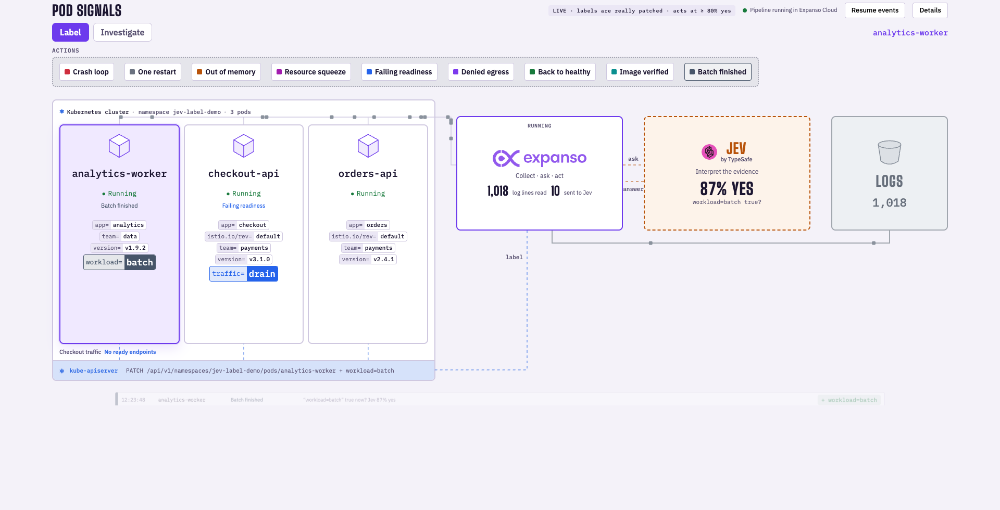

# Pod signals: labels and investigations



Labels drive routing, scheduling and policy: Services select on them,
Kyverno policies match on them, Istio routes on them. They go stale the
moment a pod's behavior changes, and a stale label is maximum chaos. This
example is the agent Nathan described: it looks at the labels available on
every pod in the cluster, compares them against each pod's current list,
and applies a label when Jev judges it true. When signals
say a label no longer holds, it takes it back off.

- **Expanso** reads every pod's logs, inventories the labels in use across
  the cluster, decides which single label change the evidence could justify,
  and requests the patch. It runs as a job in Expanso Cloud on an Edge node
  next to the cluster.
- **Jev** interprets the evidence. It answers one yes/no question per change;
  it never touches Kubernetes.
- **Kubernetes** applies the change, guarded by pod UID and resource version.
  Only labels this agent added can ever be removed by it.

## Run it

You need `uv`, `just`, Docker, `k3d`, `kubectl`, `expanso-cli` and
`expanso-edge`, plus your Expanso Cloud credentials and `TYPESAFE_API_KEY` in
the repository-root `.env` (see `../../.env.example`).

From this directory (the root also exposes the demo commands):

```bash
just up      # local k3d cluster, adapter, Edge agent, Cloud job
just down    # stop from another terminal; Ctrl-C also works
just open    # open the localhost board
just test
```

When it prints **READY**, open http://127.0.0.1:8901. Everything it creates
lives in a dedicated `jev-label-demo` cluster and the ignored
`.expanso/pod-labels/` directory.

## Two lanes through Cloud

**Labels:** Expanso Cloud schedules evidence collection and Jev judgment;
guarded Kubernetes patches add or undo labels only when justified.
`analytics-worker` starts with the external-owned `routing-tier=batch` label.
It is an observed, transferable label in the real cluster inventory, not an
agent addition: there is no ownership ledger for it, so the agent cannot undo it.

**Investigation:** synthetic source incidents progress from one ambiguous
restart, to repeated restarts near a release, to concrete memory evidence.
These scenarios propose no label changes (`prefer: []`). Cloud routes their
evidence through Jev. Choose **Investigate**, select a pod, then send
**Restart**, **Context**, and **Evidence**. Jev returns **Wait** or
**Investigate**. The latter is an evidence-readiness decision, not a diagnosis
or an automatic debugging action. Evidence is collapsed by default.

| Scenario | Synthetic evidence |
|---|---|
| `investigate_restart` | One restart; no reason or stack |
| `investigate_context` | Five restarts, timeline, recent release SHA; cause unknown |
| `investigate_evidence` | OOMKilled, exit 137, 512Mi limit, `OrderCache.load:212`, recent cache limit change |

Sentry is unavailable in this demo. No Sentry incident, issue URL or retrieved
stack is claimed; the cache stack and release details are explicitly synthetic.
The decision does not establish a root cause.

## What you see

Three pods, each carrying its ordinary labels (`app`, `team`, `version`,
`istio.io/rev`). Routine log lines stream to Expanso constantly and never
reach Jev. Every few seconds one pod writes something that needs
interpreting. Jev evaluates a meaningful classification; Expanso applies it
only when the evidence clears the confidence threshold:

| Event | Evidence in the log | Label in question |
|---|---|---|
| Crash loop | 5 restarts in 4 minutes | `health=degraded` |
| One restart | 1 restart after a planned node drain | `restart=expected` |
| Out of memory | OOMKilled, stack trace names a cache | `pressure=memory` |
| Resource squeeze | CPU, memory and latency together | `cpu=throttled` |
| Failing readiness | 6 probe failures, same upstream timeout | `traffic=drain` |
| Denied egress | denied connections plus an image digest mismatch | `security=suspicious` |
| Back to healthy | 10 minutes of clean metrics | `health=healthy` |
| Image verified | digest re-verified | `image=verified` |
| Batch finished | batch done, no HTTP listeners | `workload=batch` |

These are Kubernetes metadata labels: `health=degraded` means repeated
failures, `cpu=throttled` means CPU contention, and `traffic=drain` marks a
pod that cannot serve. The classification itself does not enforce draining
or quarantine; a controller or policy must consume it. The separate
`stable-checkout` Service still selects `routing-tier=stable`.

The decision strip shows the question, Jev's answer and what happened. The header shows the threshold in force.

### Maximum chaos, kept honest

Letting an agent rewrite labels automatically is maximum chaos in a real
cluster, which is exactly why the guardrails are the demo, not the fine
print. Jev's judgment gates every write behind a confidence threshold;
**Not supported** means the evidence did not clear that threshold.
Explicit demo events may refresh or update catalog labels this agent owns;
externally owned or edited labels remain protected;
and the agent can only remove a label it added itself, tracked in a pod
annotation that survives adapter restarts. The undo path is signal-driven:
annotate a pod with `jev.expanso.io/signal` describing what changed, and the
next evaluation asks Jev whether the label still holds. The blast radius
is visible in the demo, not theoretical.

## What is real and what is simulated

When run and verified: the pods, their stdout, Cloud execution, provider
responses and Kubernetes patches are real. Simulated: the source incidents
and their release, timeline and stack evidence. The demo pods write the log lines a
troubled workload would write; their actual containers stay healthy, so their
real status is not sent to Jev as evidence.

Jev's answers are judgments, not guarantees. In one session the same healthy
evidence scored between 25% and 89% depending on what the pod had logged
before it. That is why a threshold exists and why **Not supported** is a first-class
outcome. The adapter defaults to 90%; the local simulator uses 80%.

## Use it on your own cluster

`adapter.py`, `pipeline.yaml`, `edge.yaml` and `deploy.py` are the example.
Everything under `simulation/` exists only to produce events on a laptop.

Outside the simulator, the adapter proposes labels it observes on other pods
in the namespaces you allow (`POD_LABEL_NAMESPACES`), asks Jev whether each
fits the target pod, and records every change it makes in a pod annotation so
it can undo only its own work. It starts in dry run: set
`POD_LABEL_APPLY=true` to let it patch. It needs `get`/`list`/`patch` on pods
and `get` on `pods/log`.

Step-by-step setup for native k3s or an existing cluster, the RBAC, and how
to stop and verify: [MANUAL_SETUP.md](MANUAL_SETUP.md).

## Files

| Path | What |
|---|---|
| `pipeline.yaml` | The Expanso pipeline: wait for an event, collect, ask, apply |
| `adapter.py` | Local HTTP service the pipeline calls: Kubernetes access, the Jev call, guarded patches, the board |
| `edge.yaml`, `deploy.py` | Edge agent config and the Cloud deploy |
| `web/` | The board |
| `simulation/` | `local.py` launcher, `workload.py` event catalog, `fixtures.yaml` pods |
| `test_adapter.py`, `simulation/test_local.py` | Tests; no network, no cluster |

## Verified live

On September 20, the Cloud-managed job copied the observed batch label from
`analytics-worker` to `orders-api` (83% yes). It added checkout's routing
label and later removed it (93% each); the real Service EndpointSlice
membership followed both changes. [Label receipts](../../docs/labels-discovery-live-proof.json).

The earlier [investigation receipts](../../docs/investigation-live-proof.json)
record a superseded version that invoked Claude. The current demo ends at
Jev's evidence-readiness decision and invokes no additional model.
Incident stimuli are synthetic; inference and orchestration are real.

## General logs

Gray packets continue from Expanso into **Logs**, bypassing Jev. Each
Cloud-driven routine collection writes the local adapter's rotating
`.expanso/pod-labels/general.jsonl` sink before emitting a delivery receipt.
The gray bucket represents this local demo sink, not a provisioned cloud
storage service. Files rotate at 2 MB with two backups.

The recording view fits 1280×720 and larger desktop viewports. Event controls
sit above the pods; Expanso, Jev and Logs align above the Kubernetes API
server. Colored key-value labels remain visible for at least five seconds after arrival.
Expanso Cloud then removes the actual managed Kubernetes label; the UI follows
the confirmed pod state. Motion follows real receipts, with a 3.7-second visual replay (500 ms each way between Expanso and Jev) and 60 ms
event polling. Cloud execution proceeds immediately; the replay adds no
delay to Jev calls or Kubernetes changes.

Routine collection runs in its own input branch within the same Cloud job,
every 400 ms plus collection time. Its receipts bypass the Jev processor,
so inference does not pause general logging. Gray particles still require
real collection receipts; a stopped pipeline does not animate fake traffic.

Refreshing the page does not replay existing labels as fresh highlights.
Repeated events receive a new Jev judgment and, above the threshold, a real
Kubernetes patch that refreshes the owned label and its decision journal.
Recovery can update `health=degraded` to `health=healthy`. Existing labels
without matching ownership remain read-only and show **Already set** or
**Protected**. Each accepted repeat renews the owned label lease. The browser
acknowledges visual arrival, and Cloud starts the five-second expiry interval;
without an acknowledgement, labels expire nine seconds after application.
Cloud retries failed removals and defers expiry while a decision for that pod
is in flight. Labels remain visible until removal succeeds. External and
fixture-owned labels are preserved. Animation timing does not promise a
provider response time.

Recovery updates the health classification; it does not clear every independent
label (for example CPU pressure or a security classification) in the same patch.
